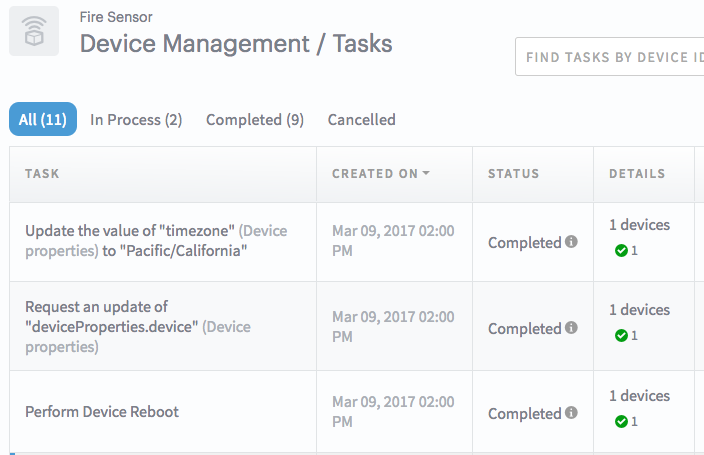

## <u>**Device Management API**</u>: Create a Task for <u>lwm2m clients</u>

This sample app will create a  `TaskRequest` to ARTIK Cloud using the `DevicesManagement Task API`. 

The TaskRequests will be immediately scheduled to `ARTIK Cloud` and will act on any connected LWM2M clients.

## <u>Requirements:</u>

- Import to project [ARTIK Cloud Java SDK ](https://github.com/artikcloud/artikcloud-java)
- Console `Sample Program` from [LWM2M C Client SDK](https://github.com/artikcloud/artikcloud-lwm2m-c)
- Java >= 7

## <u>Setup / Installation:</u>

### Setup at ARTIK Cloud

 1. [Create a device type](https://developer.artik.cloud/documentation/tools/web-tools.html#creating-a-device-type) (or use the one you already own) in the [Developer Dashboard](https://developer.artik.cloud/).   

 2. Enable [Device Management Properties](https://developer.artik.cloud/documentation/advanced-features/device-management.html#device-management-in-the-developer-dashboard) for your device type. You do this in the [Device Type Dashboard](https://developer.artik.cloud/dashboard/devicetypes)—> Select Your Device Type —> Select Device Management —> Click "Enable Device Properties".

 3. At [My ARTIK Cloud](https://my.artik.cloud/), [Connect a device](https://developer.artik.cloud/documentation/tools/web-tools.html#connecting-a-device) (or use the one you already own) of the device type. Get the [device ID and token](https://developer.artik.cloud/documentation/tools/web-tools.html#managing-a-device-token), which you will need when running the example client later.

### Setup the Java project

**Clone this sample and import project to your IDE**

`%> git clone https://github.com/artikcloud/tutorial-java-deviceManagementLWM2MStarter` 

**Import project and Install ARTIK Cloud Java SDK**

1.  Update the `pom.xml` file with the latest version of ARTIK Cloud Java SDK

    ```
    <dependency>
      <groupId>cloud.artik</groupId>
      <artifactId>artikcloud-java</artifactId>
      <version>2.0.7</version>
    </dependency>
    ```

2. Import the project into your IDE.   If you are using eclipse, import the project as an `existing maven project`.

3. Install the SDK using `maven`.    **Alternatively**, download and install jar file manually by searching for `artikcloud` at `https://search.maven.org/`  and download the latest jar file (ie: `artikcloud-java-2.0.7-jar-with-dependencies.jar` ).   Import this jar file to your project.

    If you are using eclipse, you can install the jar file by `Right-Click project —> Properties —> Java Build Path —> Libraries —> Add Jar` .   **Advanced users** may wish to follow instructions to build the SDK directly —  [ARTIK Cloud Java SDK](https://github.com/artikcloud/artikcloud-java)

**Update the Config.java file **

Add your `Device Id`  and `Device Type Id` to the `Config.java` file you retrieved earlier.  Additionally add your `User Access Token` to the `Config.java`.   

*Note: <u>User Access_Token</u>  - The User Access Token is obtained by OAuth2.   For convenience, you can retrieve a temporary user token by logging into the [API-Console](#resources).  After logging in — make any request (ie:  /users/self endpoint) and an `access token` is viewable in the header section*

```
{
    "Content-Type": "application/json",
    "Authorization": "Bearer YOUR_ACCESS_TOKEN"
}
```

### Setup the LWM2M console `sample program`

The `[ARTIK Cloud LWM2M Client SDK for C ` has console `sample program`.   It is a sample console application which will be used to establish a LWM2M device connection to ARTIK Cloud.

1. Build and run the `sample program` using the following instructions:  [ARTIK Cloud LWM2M C SDK](https://github.com/artikcloud/artikcloud-lwm2m-c)

2. Connect your device with the LWM2M `sample program` and supply the `device id` and `device token` as parameters.   **Keep this connection open.**

   ```
   %> akc_client -n -u coaps://coaps-api.artik.cloud:5686 -d YOUR_DEVICE_ID -t YOUR_DEVICE_TOKEN
   ```

3. **The LWM2M `sample progrm` will also output to console when it receives a task.**  Here are a couple commands to familiarize yourself with the `sample program`.

   To `read` from **Object 3 / Resource 15** which is the <u>timezone property</u> of the device

   ```
   client%> read /3/0/15
   URI: /3/0/15 - Value: America/Los_Angeles
   ```

   You can `write` a property in similar fashion using the `change` command

   ```
   client%> change /3/0/15 Europe/Paris
   ```

   *Note:  Check out the [LWM2M documentation](https://developer.artik.cloud/documentation/advanced-features/manage-devices-using-lwm2m.html) for more information on object/resources

### Run the sample code:

Run the QuickStartTasks.java file.  

#### **Learn more about the code:** 

Here we instantiated `DevicesManagementAPI()` and we create 3 `TaskRequests`

```java
/** ARTIK Cloud DevicesManagementApi */
DevicesManagementApi devicesManagementApi = new DevicesManagementApi();

/** Here we instantiate 3 TaskRequest instances */
TaskRequest readDevicePropertiesTask = new TaskRequest();
TaskRequest writeDeviceTaskRequest = new TaskRequest();
TaskRequest executeRebootTaskRequest = new TaskRequest();
```

#### Setup the `TaskRequest`.   

Here we show a setup for `read` `write` and `execute` TaskRequest.

```java
/** Create the 'read' TaskRequest with the following properties 
		 * - here we read properties from device to ARTIK Cloud*/
readDevicePropertiesTask.dtid(Config.DEVICE_TYPE_ID);
readDevicePropertiesTask.dids(Arrays.asList(Config.DEVICE_IDS));
readDevicePropertiesTask.taskType("R");
readDevicePropertiesTask.setProperty("deviceProperties.device");


/** Create 'write' TaskRequest with the following properties 
		 * - here we write to the timezone property */
writeDeviceTaskRequest.dtid(Config.DEVICE_TYPE_ID);
writeDeviceTaskRequest.dids(Arrays.asList(Config.DEVICE_IDS));
writeDeviceTaskRequest.taskType("W");
writeDeviceTaskRequest.setProperty("deviceProperties.device.timezone");
writeDeviceTaskRequest.taskParameters(new TaskParameters().value("America/Los_Angeles"));


/** Create 'execute' TaskRequet with the following properties 
		 * - here we execute reboot on the device */
executeRebootTaskRequest.dtid(Config.DEVICE_TYPE_ID);
executeRebootTaskRequest.dids(Arrays.asList(Config.DEVICE_IDS));
executeRebootTaskRequest.taskType("E");
executeRebootTaskRequest.setProperty("deviceProperties.device.reboot");
```

#### Send the `TaskRequest` to ARTIK Cloud:

```java
/** Make the async call for the 3 Tasks we created earlier */
try {
  devicesManagementApi.createTasksAsync(readDevicePropertiesTask, taskAsyncCallback);
  devicesManagementApi.createTasksAsync(writeDeviceTaskRequest, taskAsyncCallback);
  devicesManagementApi.createTasksAsync(executeRebootTaskRequest, taskAsyncCallback);
} catch (ApiException e) {
  e.printStackTrace();
} catch (Exception e) {
  e.printStackTrace();
}
```

#### Here's a sample response:

```javascript
//From callback success 
TaskEnvelope:class TaskEnvelope {
data: class Task {
    filter: null
    taskType: W
    modifiedOn: 1482279165339
    dtid: dtabcdef123456789000000
    statusCounts: class TaskStatusCounts {
        numFailed: 0
        numCancelled: 0
        totalDevices: 0
        numCompleted: 0
        numSucceeded: 0
    }
    property: deviceProperties.device.timezone
    id: <REDACTED-TASK-ID>
    dids: [<REDACTED-DEVICE-ID>]
    taskParameters: class TaskParameters {
        expiresAfter: 604800
        value: America/Los_Angeles
    }
    createdOn: 1482279165339
    status: REQUESTED
}
```

The LWM2M console `sample program` will also show some console output

```
$ ./akc_client -n -u coaps://coaps-api.artik.cloud:5686 -d yourdeviceid -t yourdevicetoken
> REBOOT
Resource Changed: /3/0/15
```

#### Task Dashboard

The Task Dashboard is available in the following path: 

`Developer Dashboard —> Device Types (Select Your Device Type) —> Device Management —> Tasks`

**Screenshot:**




## More examples

- Peek into [tests](https://github.com/artikcloud/artikcloud-java/tree/master/src/test/java/cloud/artik/api) in `ARTIK Cloud Java SDK` for more device management SDK usage examples.
- [Devices Management Starter Code](https://github.com/artikcloud/tutorial-java-deviceManagementStarterCode) learn to read and write to `server properties`.

## Device Management Resources

[Devices Management Java SDK API](https://github.com/artikcloud/artikcloud-java/blob/master/docs/DevicesManagementApi.md) 

[Devices Management REST API](https://developer.artik.cloud/documentation/api-reference/rest-api.html#device-management)

[Devices Management LWM2M - Java Client](https://github.com/artikcloud/artikcloud-lwm2m-java)

[Devices Management LWM2M - C Client](https://github.com/artikcloud/artikcloud-lwm2m-c)


More about ARTIK Cloud
----------------------

If you are not familiar with ARTIK Cloud, we have extensive documentation at https://developer.artik.cloud/documentation

The full ARTIK Cloud API specification can be found at https://developer.artik.cloud/documentation/api-reference/

Check out advanced sample applications at https://developer.artik.cloud/documentation/samples/

To create and manage your services and devices on ARTIK Cloud, create an account at https://developer.artik.cloud

Also see the ARTIK Cloud blog for tutorials, updates, and more: http://artik.io/blog/cloud


License and Copyright
---------------------

Licensed under the Apache License. See [LICENSE](https://github.com/artikcloud/artikcloud-java/blob/master/LICENSE).

Copyright (c) 2017 Samsung Electronics Co., Ltd.


